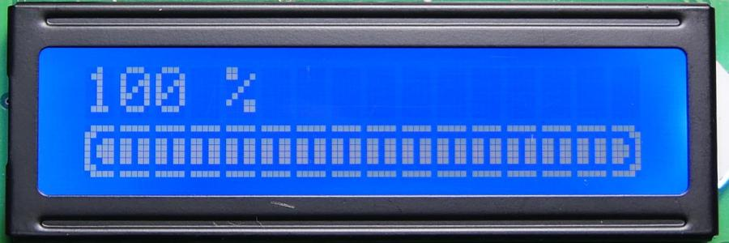

# Connecter un écran LCD à un Raspberry

Notre écran LCD 4x20 s'appuie sur une [puce HD44780](https://www.sparkfun.com/datasheets/LCD/HD44780.pdf)
(comme la majorité des écrans LDC 2 ou 4 lignes). Il se connecte via le bus i2c, ce qui ne nécessite 
que 4 câbles.

Notre version est flashée avec le jeu de caractères 'A' (chinois).


## Que faire avec un LCD ?

On peut faire des trucs assez sympas avec un LCD,
des [plus simples](https://learn.adafruit.com/drive-a-16x2-lcd-directly-with-a-raspberry-pi/python-code)
aux [plus pointus](https://hackaday.com/2013/10/16/teach-an-old-lcd-new-tricks/).

L'écran permet la définition de caractères personnalisés (8x5 pixels), ce qui permet d'aller encore plus loin
comme avec cette progress bar.

[](https://www.carnetdumaker.net/articles/faire-une-barre-de-progression-avec-arduino-et-liquidcrystal/).

## Configuration

Par défaut, le bus I2C n'est pas activé sur le raspberry.

On commence par activer le module du noyau.

```bash
$ sudo nano /etc/modules
```

Ajouter (ou décommenter les deux lignes suivantes) :

```
i2c-bcm2708 
i2c-dev
````

Enregistrer le fichier et redémarrer (`sudo reboot`).

Si besoin (normalement pas sur une nouvelle installation),
supprimer le module de la blacklist.

```bash
$ sudo nano /etc/modprobe.d/raspi-blacklist.conf
# commenter si pas déjà fait la ligne ci-dessous
#blacklist i2c-bcm2708
```

Enfin, on va modifier la config globale :

```bash
$ sudo raspi-config
```
En fonction des versions, aller dans le menu :
* "5 - Interfacing Options" >> "P5 I2C"
* "8 - Advanced Options" >> "A7 I2C – Enable/Disable automatic loading"

Would you like the ARM I2C interface to be enabled? Choisir "Yes",
quitter l'utilitaire et redémarrer (`sudo reboot`).

Si ce n'est pas suffisant, il faut également éditer 
le fichier de config global `/boot/config.txt`
et ajouter vers la fin :

```
dtparam=i2c=on,i2s=on,spi=on
dtparam=i2c1=on
dtparam=i2c_arm=on
```

Pour vérifier que tout marche bien, on peut installer les outils smbus.

```bash
$ sudo apt-get update
$ sudo apt-get install i2c-tools
$ sudo i2cdetect -y 1
     0  1  2  3  4  5  6  7  8  9  a  b  c  d  e  f
00:          -- -- -- -- -- -- -- -- -- -- -- -- -- 
10: -- -- -- -- -- -- -- -- -- -- -- -- -- -- -- -- 
20: -- -- -- -- -- -- -- 27 -- -- -- -- -- -- -- -- 
30: -- -- -- -- -- -- -- -- -- -- -- -- -- -- -- -- 
40: -- -- -- -- -- -- -- -- -- -- -- -- -- -- -- -- 
50: -- -- -- -- -- -- -- -- -- -- -- -- -- -- -- -- 
60: -- -- -- -- -- -- -- -- -- -- -- -- -- -- -- -- 
70: -- -- -- -- -- -- -- --
```

Notre écran est bien détecté sur l'adresse I2C 0x27 \\0/.

## Python

On va avoir besoin de la librairie python smbus.

```
$ sudo apt-get install python-smbus python3-smbus python-dev python3-dev i2c-tools
```

La librairie smbus est très bas niveau. Pour faciliter le développement,
on va utiliser une librairie plus complète : `lcddriver.py`.
Plusieurs versions sont disponibles sur le net, celle présente ici
en est une compilation.

## Caractères personnalisés

La définition des caractères se fait en construisant une matrice de bits 8x5 :
8 octets (du haut vers le bas) dont seuls les 5 bits de poids faible sont utilisés.

```
+-----+
| ▮▮▮ |  01110
|▮▮▮ ▮|  11101
|▮▮▮▮▮|  11111
|▮▮▮  |  11100  
|▮▮   |  11000
|▮▮▮  |  11100
| ▮▮▮▮|  01111
| ▮▮▮ |  01110
+-----+
```

Ensuite il faut programmer le lcd :

```python
# 4 est le numéro du caractère (de 0 à 7)
lcd.load_custom_char(4, [0b01110,0b11101,0b11111,0b11100,0b11000,0b11100,0b01111,0b01110])
```

Pour faciliter leur création, j'ai amélioré une [page html](char_gen.html) « wysiwyg » qui traîne sur l'Internet :
définition « point and click » des caractères avec génération du code correspondant, et possibilité de ré-éditer à partir du code généré.

## Automatiser le démarrage du script

Plusieurs méthodes disponible (`@reboot`avec un cron par exemple).
Ici on va faire simple :

```bash
$ cat rc.local 
#!/bin/sh -e
#
# rc.local
#
# This script is executed at the end of each multiuser runlevel.
# Make sure that the script will "exit 0" on success or any other
# value on error.
#
# In order to enable or disable this script just change the execution
# bits.
#
# By default this script does nothing.

# Print the IP address
_IP=$(hostname -I) || true
if [ "$_IP" ]; then
  printf "My IP address is %s\n" "$_IP"
fi

# nécessite le chemin absolu vers le script
python /home/pi/Workspace/main.py &

exit 0
```

## Un décompte de nouvel-an

TBD